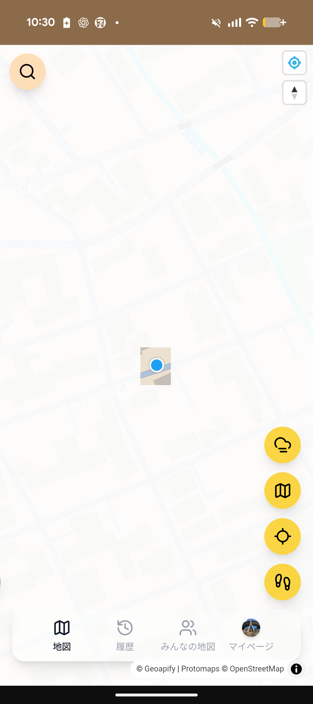
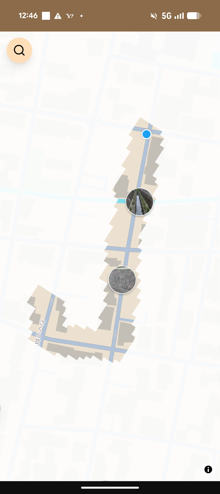
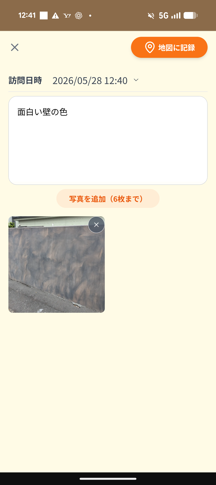
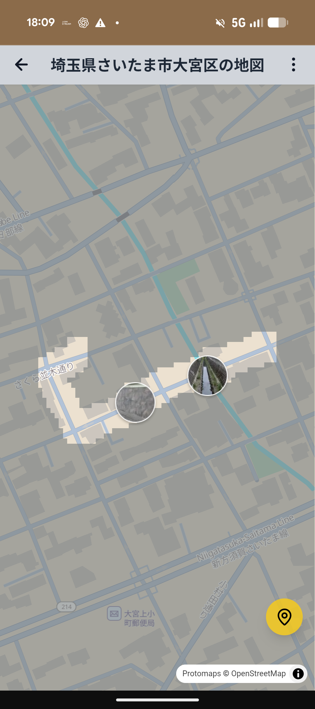
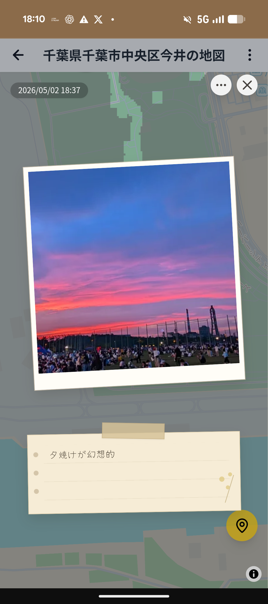
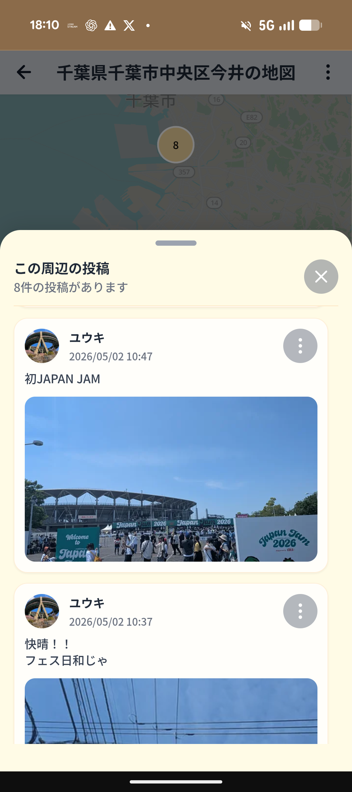
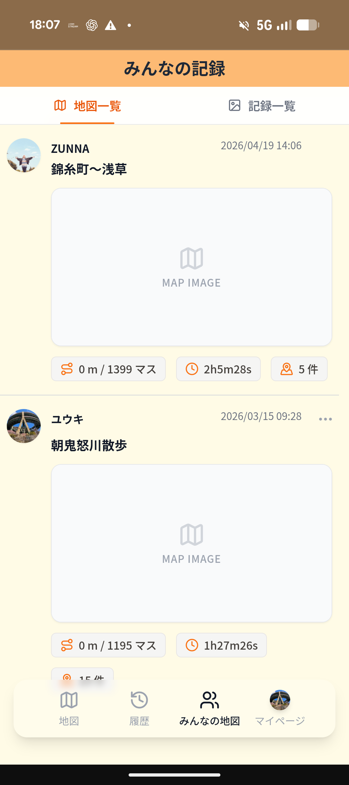
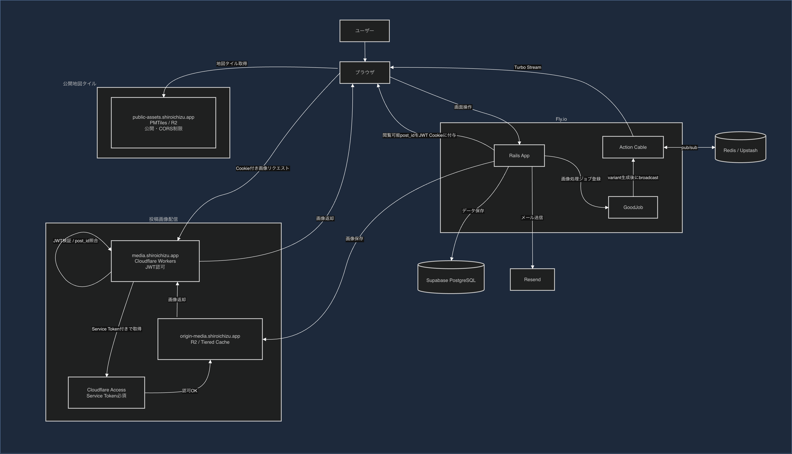
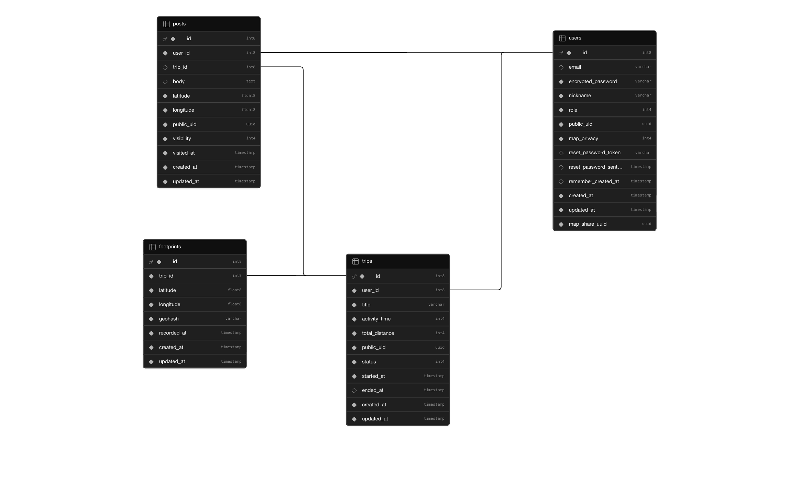

# シロイチズ

## サービスURL
https://shiroichizu.app

## 使い方

1. サービスURLにアクセス
2. チュートリアル終了後「同意して始める」ボタンでゲストユーザーが作成され、登録なしで利用可能です
3. 位置情報を許可して、探索ボタンで自分だけの地図を作成可能となります
4. ゲストユーザーを作成しなくても、「みんなの地図」から公開されている地図や投稿を閲覧できます

## サービス概要

シロイチズは、一面が白い霧で覆われた地図を、自分の足で歩いて少しずつ開拓していく探索アプリです。
探索を開始して実際に歩くと、移動した範囲に応じて地図上の霧が晴れ、自分だけの探索地図として記録されます。

一般的な地図アプリのように目的地までの最短ルートを案内するのではなく、あえてルート案内や情報を表示しないことで、目の前の街並みや道中の小さな発見に意識を向けられるように設計しました。

また、過去に探索した範囲を地図上に反映できるため、まだ訪れたことのない道を自然と歩きたくなる体験を提供します。
探索中に見つけた景色や出来事は、写真やメモとして地図上に投稿でき、歩いた記録だけでなく、その場所で感じたことも残せる「自分だけの発見の地図」を作ることができます。

## 特徴

- 目的地ではなく「道中の発見」を楽しむ地図アプリ
- 歩いた場所だけ霧が晴れる探索体験
- 写真やメモを地図上に残せる発見記録
- 公開された地図や投稿から、他の人の街の見方を楽しめる

## 特にこだわっているポイント

- MapLibre GL JSのカスタムレイヤーとWebGLを用いた霧表現
- Cloudflare Workers、Cloudflare R2とJWTを用いた画像配信と認可制御
- PMTilesとCloudflare R2による低コストな地図タイル配信
- RSpecによる公開範囲・認可まわりのテスト

## 開発背景

私は普段、Google Mapを見ながら目的地まで最短で向かうことが多く、移動中も「どうすれば早く着けるか」ばかりを考えていました。

一方で、彼女と街を歩いていると、彼女は道端の花や金木犀の香り、雨上がりの虹など、私がまったく気づかなかったものを次々と見つけていました。同じ道を歩いているはずなのに、見えている世界がまったく違うことに驚き、自分もそんなふうに道中の小さな発見を楽しめるようになりたいと思いました。

シロイチズは、その思いから作ったアプリです。

あえて地図を白い霧で覆い、実際に自分の足で歩いた場所だけが少しずつ見えるようにすることで、効率や最短ルートから少し離れ、歩くこと自体を楽しめる体験を目指しています。

さらに、道中で見つけた景色や、そのとき感じたことを写真やメモとして地図上に残せるようにしました。ただの移動ログではなく、自分だけの発見や思いが積み重なっていく「感情の地図」を作れるサービスにしたいと考えています。

## スクリーンショット

  
  
  
  

  
  
  
  

## 主な機能

- 位置情報を使った探索地図の作成\
  現在地を記録しながら移動することで、自分だけの探索地図を作成できます。

- 移動に応じて地図上の霧が晴れる探索機能\
  未探索の場所は霧で覆われ、実際に訪れた場所だけが少しずつ見えるようになります。

- 累計地図表示機能\
  探索中でもボタン一つで過去に開放した場所を表示でき、まだ訪れていない場所を確認しながら探索できます。

- 写真・メモ投稿機能\
  探索中に見つけた景色や出来事を、写真やメモとして地図上に記録できます。

- 作成した地図の振り返り機能\
  過去に作成した地図を一覧から確認し、探索した範囲や投稿を振り返ることができます。

- 地図上の投稿表示機能\
  地図上の投稿アイコンをタップすると、その場所で投稿した写真やメモを確認できます。

- クラスタ表示機能\
  近くに複数の投稿がある場合は、まとめて表示し、周辺の投稿を一覧で確認できます。

- 地図・投稿の公開機能\
  作成した地図や投稿を公開し、他のユーザーに共有できます。

- みんなの地図・記録閲覧機能\
  他のユーザーが公開した地図や投稿を閲覧し、さまざまな場所の歩き方や発見を楽しめます。

- ゲストユーザー機能\
  アカウント登録前でも、アプリの基本的な体験を試すことができます。

## 技術構成図

## 技術選定の方針・理由

技術選定では、限られた開発時間の中で完成度を高めること、自分の想定内の地図表現ができること、個人開発として継続可能な運用コストに抑えることを重視しました。

### Ruby on Rails / Hotwire / Stimulus

バックエンドにはRuby on Rails 7.2.1を採用しました。

RUNTEQで学習していたこともあり、過去のアプリ開発でもRailsを使用した経験があったためです。仕事をしながらの個人開発で開発時間が限られていたことから、新しい技術を採用するよりも、学習済みで実装経験のある技術を使い、確実に完成させることを優先しました。

フロントエンドについても、実現したい機能はRailsとStimulusで構築できると判断したため、Railsとの親和性が高いHotwire / TurboとStimulusを中心に構成しました。

### MapLibre GL JS

地図描画にはMapLibre GL JSを採用しました。

Google Mapsでは、地図上を独自の霧で覆う表現について規約面やカスタマイズ面で制約があると判断したためです。

MapLibre GL JSは、レイヤーを利用した独自表現が可能であり、さまざまな地図タイルと組み合わせられるため、歩いた場所だけ霧が晴れる本アプリの表現に適していると考えました。

### PMTiles / Cloudflare R2

当初はMapTilerから地図タイルを取得していましたが、テスト段階で想定以上にタイル使用量が増えることが分かり、個人で継続運用するにはコスト面に課題があると判断しました。

そのため、地図タイルをPMTiles形式で用意し、Cloudflare R2から配信する構成へ変更しました。

Cloudflareは、R2を比較的低コストで利用できることに加え、キャッシュ機能が充実しており、WorkersやAccessなどの周辺機能も組み合わせられるため採用しました。

### Fly.io / Supabase PostgreSQL

アプリケーションのデプロイ先にはFly.ioを採用しました。

日本のユーザーを主な対象としているため東京リージョンを利用できること、CLIを中心に管理できること、デプロイが容易であることを重視しました。また、必要に応じてMachine数を変更しやすい点も、運用しやすいと考えた理由です。

データベースにはSupabase PostgreSQLを採用しました。

東京リージョンを選択でき、管理画面からテーブルやデータを確認しやすく、個人開発でもDBの運用負担を抑えられると考えたためです。Fly.io上でPostgreSQLまで管理する方法も検討しましたが、管理する範囲を増やしすぎず、アプリケーション開発に集中できる構成を選びました。

## 技術的に工夫した点

### MapLibre GL JSとWebGLを用いた探索範囲の可視化

位置情報をもとに探索済みエリアを記録し、地図上の霧が晴れていくように可視化しています。
探索中のリアルタイム表示だけでなく、過去に作成した地図の再現表示にも対応し、「歩いた場所が自分だけの地図として残る」体験を実現しました。

当初は、地図全体をgeohashのセルに分割し、開放済みのセルだけを透明化する方式で実装していました。
しかし、ズーム率に応じてgeohashの精度を変えると、ズームアウト時に広範囲が一気に開放されてしまい、逆に精度を固定すると表示対象のセル数が増えすぎて描画負荷が高くなる課題がありました。

その後、Turf.jsを用いて巨大な霧ポリゴンから探索済み範囲を差し引く方式も試しましたが、探索済みエリアが増えるほどポリゴン演算の負荷が大きくなり、累計地図の表示が重くなる問題がありました。

現在は、MapLibre GL JSのカスタムレイヤーとしてWebGLを利用し、GPU側で霧の描画と探索済みエリアのマスク処理を行う方式に変更しています。
これにより、大量のgeohashセルや複雑なポリゴン演算をJavaScript側で毎回処理する必要を減らし、探索済みエリアが増えても比較的軽量に霧の表示を行えるようにしました。

また、WebGLのコンテキストはブラウザのメモリ状況やバックグラウンド復帰時に失われることがあるため「webglcontextrestored」イベントを検知し、カスタムレイヤーを再初期化して霧表示を復旧する処理も実装しています。

### Cloudflare Workersを用いた画像配信と認可制御

投稿画像はCloudflare R2に保存し、Cloudflare Workers経由で配信する構成にしています。
当初はRails側で画像リクエストごとに認可判定を行っていましたが、表示速度や負荷の課題があったため、Cloudflare Workersを用いた配信構成に変更しました。

画像表示の高速化のためにCloudflareのエッジキャッシュを活用しつつ、非公開の投稿画像が外部から直接閲覧されないよう、Worker側で認可判定を行っています。
具体的には、Rails側で閲覧可能な投稿IDをJWTとしてCookieに保持し、Worker側では画像URLに含まれる投稿IDとJWTの内容を照合してアクセス可否を判定しています。
これにより、Railsアプリを画像配信のたびに経由させずに、投稿単位のアクセス制御とエッジキャッシュを両立できるようにしました。

また、Cloudflare Workers側が投稿IDだけで画像を取得・判定できるようにするため、ActiveStorageの保存キーをカスタマイズし、画像やvariantの保存パスに投稿IDを含める設計にしています。
これにより、Railsアプリを経由せずに画像を配信しながらも、投稿の公開設定に応じた認可制御とキャッシュの両立を実現しました。

### PMTilesとCloudflare R2による地図タイル配信

当初は外部の地図タイルサービスを利用していましたが、地図アプリでは少人数のテスト利用でもタイルリクエスト数が増えやすく、運用コスト面に課題がありました。

そこで、地図タイルをPMTiles形式で静的ファイルとして管理し、Cloudflare R2から配信する構成に変更しました。
PMTilesは単一ファイルとして地図タイルを扱えるため、専用のタイルサーバーを用意せず、R2などのオブジェクトストレージに配置するだけで地図表示に利用できます。

また、シロイチズでは詳細な情報を表示しない設計のため、必要なズームレベルを検証し、表示品質とファイルサイズのバランスを考慮して利用するタイルデータを調整しました。
これにより、アプリサーバーへの負荷を増やさず、低コストで地図表示を行える構成にしています。

### GoodJob + Redis + Action Cableによる画像反映の非同期化

投稿画像のサムネイルや地図アイコン用画像は、GoodJobを使ってバックグラウンドで生成しています。
画像処理の完了後はRedisを利用したAction CableのTurbo Streamによって、地図上の投稿アイコンをリアルタイムに反映するようにしました。

これにより、投稿時に画像処理の完了を待たせず、ユーザー体験を損なわない形で地図画面へ画像を反映できるようにしています。

## 使用技術

### バックエンド
- Ruby on Rails 7.2.1
- Supabase PostgreSQL
- Devise
- GoodJob
- Redis
- Action Cable

### フロントエンド
- Hotwire / Turbo
- Stimulus
- Tailwind CSS
- MapLibre GL JS
- WebGL

### 地図・位置情報
- PMTiles
- OpenStreetMap
- Geohash
- geolib
- Geoapify
- HeartRails Geo API

### 画像配信・ストレージ
- Active Storage
- Cloudflare R2
- Cloudflare Workers
- Cloudflare Access
- Cloudflare Cache / Cache Rules

### インフラ・外部サービス
- Fly.io
- Resend

## テスト・品質管理・監視

- RSpecを導入し、Model SpecとRequest Specを作成
  - Model Spec
    - User / Trip / Post / Footprint のバリデーション
    - 公開範囲判定
    - UUID自動生成
    - 関連データ削除
  - Request Spec
    - 地図・投稿の公開設定ごとの閲覧可否
    - 地図・投稿一覧への表示条件
    - 地図詳細画面で使用するJSONレスポンス

- GitHub ActionsでRSpecを自動実行

- RuboCopによるコード整形・静的解析
- Sentryによるフロントエンドエラーの監視
- BulletによるN+1クエリの検知

## 画面遷移図リンク
※画面遷移図は開発当初に作成したものとなっていて、各ページのレイアウトが実際のものとは変わっていますが、構成はほぼ変わっていません。\
Figma：https://www.figma.com/design/2NG3yydL45v7LcEbcWVnDs/%E7%94%BB%E9%9D%A2%E9%81%B7%E7%A7%BB%E5%9B%B3?node-id=0-1&t=SFRbcpjoe1fuacKC-1

## ER図

## 今後の改善予定

- 作成した地図のサムネイル・OGP画像生成機能
- 累計地図の共有機能
- 投稿の編集・公開設定変更機能
- 複数の地図をまとめる機能・1つの地図を時間で分割する機能
- 累計地図の期間指定フィルター機能
- GPSの誤差で保存された探索範囲を修正できる機能
- プライバシーエリア設定（自宅周辺など、記録・公開したくない範囲のマスク）
- 地図・投稿の検索・フィルタリング機能
- 一覧表示のページネーション対応
- 探索距離・開放マス数の集計機能
- 実績・バッジ・イベント機能

## 環境構築

必要な環境変数は「.env.example」を参照してください。
本番環境ではFly.ioのSecretsとCloudflare Workersの環境変数に設定しています。

## 関連ドキュメント

- [MVP提出時点のサービス構想](docs/mvp_concept.md)\
※MVP提出時点の構想であり、現在の実装とは一部異なります。
